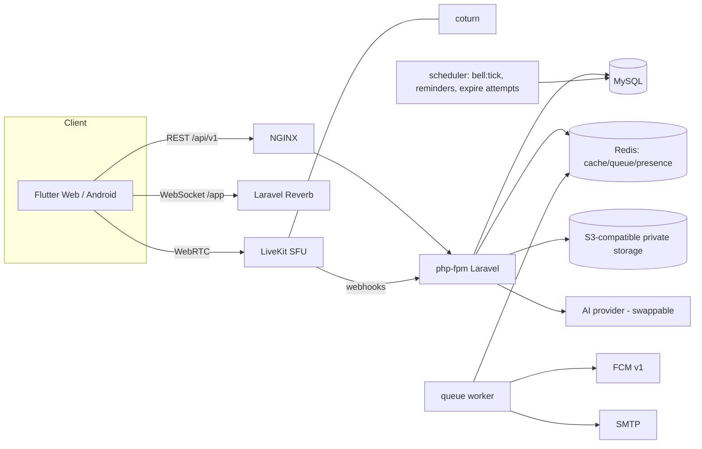
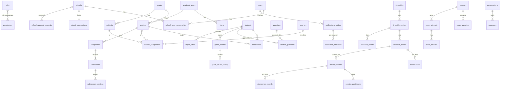

# معماری

## اصول
1. **مدرسه از سرور تعیین می‌شود نه از کلاینت.** `ResolveSchool` عضویت فعال کاربر در مدرسهٔ فعال را بررسی می‌کند؛ سپس `CurrentSchool` (scoped در container) مقدار می‌گیرد. مدل‌های tenant با `BelongsToSchool` یک Global Scope دارند که **بدون tenant هیچ ردیفی برنمی‌گرداند**. Jobها/Commandها با `CurrentSchool::run($school, fn)` وارد زمینهٔ مدرسه می‌شوند. `X-School-Id` فقط انتخاب‌گر است.
2. **دسترسی سطر‌به‌سطر** در سرویس `Access`: کارکنان همه‌چیز مدرسه، معلم فقط کلاس‌های تخصیص‌یافته، دانش‌آموز فقط خودش، والد فقط فرزندان با پیوند «تأییدشده».
3. **Idempotency در لایهٔ داده.** رویداد زنگ `unique(school_id,on_date,period_id,event)`؛ اعلان `unique(user_id,dedupe_key)`؛ تحویل `unique(notification_id,channel)`؛ پیام `client_id`؛ تلاش آزمون با قفل ردیف. اجرای دوبارهٔ Job یا هم‌پوشانی Scheduler اثری ندارد.
4. **زمان فقط زمان سرور** در منطقهٔ زمانی مدرسه؛ `fires_at` به UTC ذخیره می‌شود. مهلت آزمون را سرور تعیین می‌کند (۱۰ ثانیه تلورانس شبکه).
5. **سابقه حذف نمی‌شود.** برنامه‌ها بایگانی، دانش‌آموز «بایگانی»، نمرهٔ تأییدشده فقط با دلیل و تاریخچه تغییر می‌کند، Audit فقط‌افزودنی است.
6. **هیچ قابلیت ساختگی.** سرویس بیرونی (SFU، FCM، AI، S3) با Adapter واقعی وصل می‌شود؛ پیکربندی‌نشده ⇒ کد خطای صریح (`media_unconfigured`، …) و نمایش «پیکربندی نشده» در UI.

## نمای کلی

## ماژول‌های Backend (`app/Modules`)
| ماژول | مسئولیت |
|---|---|
| Auth | ورود/خروج/بازیابی رمز، توکن Sanctum، محدودیت نرخ |
| Tenancy | `CurrentSchool`، `SchoolScope`، `ResolveSchool` (شامل دسترسی پشتیبان زمان‌دار فقط‌خواندنی)، `RequirePermission`، `Access` |
| Schools | ثبت‌نام، تأیید/رد/نیاز به اصلاح، تعلیق، اشتراک |
| Academics | سال/ترم/پایه/درس/کلاس/دانش‌آموز/معلم/والد/ثبت‌نام/تخصیص/تقویم |
| Scheduling | برنامهٔ هفتگی نسخه‌دار، تشخیص تداخل، جایگزین/لغو، موتور زنگ (`BellEngine`) |
| VirtualClassrooms | جلسهٔ زنده، حضور، `MediaProvider` (LiveKit / Null)، وب‌هوک، وایت‌برد، گزارش مشکل |
| Attendance | حضور و غیاب خودکار از ورود/خروج جلسه + اصلاح دستی |
| Messaging | گفت‌وگوی کلاس و مستقیم، سیاست مدرسه، گزارش و مدیریت پیام |
| Learning | مطالب، تکلیف (متن/فایل/فرمول/صدا)، بازگشت برای اصلاح، نسخه‌های تحویل |
| Exams | بانک سؤال، آزمون زمان‌دار، تصحیح خودکار/دستی، انتشار نتیجه، تحلیل |
| Grading | نمرهٔ پیش‌نویس/تأییدشده، تاریخچه، فرمول معدل |
| ReportCards | قالب، تولید فقط از نمرات تأییدشده، صدور/ابطال، PDF فارسی (mPDF + وزیرمتن) |
| Notifications | outbox، کانال‌ها (realtime / FCM / ایمیل)، ترجیحات کاربر |
| AI | `AiProvider` (Null / Anthropic / سازگار با OpenAI)، ناشناس‌ساز، منابع قابل‌نمایش، بودجهٔ روزانه، پیشنهادهای مشورتی |
| Files | ذخیرهٔ خصوصی، تشخیص نوع از بایت‌ها، لینک امضاشدهٔ ۵ دقیقه‌ای |
| Imports | ورود گروهی CSV/XLSX، خروجی داده |
| Analytics | گزارش‌های محاسبه‌شده از داده (بدون AI) |
| Support | تیکت، درخواست جلسه، دسترسی پشتیبان |
| Administration | پنل مدیر کل و مدیر مدرسه، سلامت سرویس‌ها |
| Realtime | کانال‌های خصوصی Reverb و مجوز آن‌ها (`ChannelAuth`) |
| Audit | رویدادهای فقط‌افزودنی |

## ERD (خلاصه)

فهرست دقیق جداول در `backend/database/migrations/*` است (همهٔ جداول tenant ستون `school_id` و ایندکس با پیشوند `school_id` دارند).

## ماتریس مجوز
منبع حقیقت: `backend/config/rbac.php` (با `php artisan rbac:sync` به DB می‌رود). نقش‌های `super_admin`/`support` در `users.platform_role` هستند و فقط روی `/platform/*` اعمال می‌شوند؛ **هیچ مجوز پیش‌فرضی برای خواندن داده‌های دانش‌آموزان در سطح platform وجود ندارد.** پشتیبان فقط با اجازهٔ زمان‌دارِ مدیر مدرسه و فقط به مسیرهای ساختاری دسترسی خواندنی دارد.

| مجوز | مدیر مدرسه | معاون | معلم | دانش‌آموز | والد | توضیح |
|---|:-:|:-:|:-:|:-:|:-:|---|
| `school.settings` | ✔ |  |  |  |  | Edit school profile, settings and policies |
| `people.manage` | ✔ | ✔ |  |  |  | Create/edit teachers, students, guardians, memberships |
| `academics.view` | ✔ | ✔ | ✔ |  |  | View years, grades, sections, subjects, assignments |
| `academics.manage` | ✔ | ✔ |  |  |  | Manage years, grades, sections, subjects, assignments, enrollments |
| `schedule.view` | ✔ | ✔ |  |  |  | View the full school timetable |
| `schedule.manage` | ✔ | ✔ |  |  |  | Edit timetable, bell periods, calendar, substitutions |
| `schedule.own` | ✔ | ✔ | ✔ | ✔ |  | View own schedule (teacher/student) |
| `audit.view` | ✔ |  |  |  |  | View school audit log |
| `attendance.take` | ✔ | ✔ | ✔ |  |  | Record/confirm attendance for own classes |
| `attendance.view_all` | ✔ | ✔ |  |  |  | View attendance of every class |
| `content.manage` | ✔ |  | ✔ |  |  | Publish materials and assignments for own classes |
| `learn.participate` | ✔ |  |  | ✔ |  | Student: open materials, submit work, take exams |
| `guardian.access` | ✔ |  |  |  | ✔ | Guardian: view approved children |
| `exams.manage` | ✔ |  | ✔ |  |  | Question bank and exams for own classes |
| `grades.enter` | ✔ |  | ✔ |  |  | Enter grades for own classes |
| `grades.approve` | ✔ | ✔ |  |  |  | Approve/finalise grades and change approved grades |
| `reportcards.manage` | ✔ | ✔ |  |  |  | Templates, generate and issue report cards |
| `sessions.host` | ✔ |  | ✔ |  |  | Host live classes for own classes |
| `sessions.monitor` | ✔ | ✔ |  |  |  | Monitor every live class |
| `messaging.use` | ✔ | ✔ | ✔ | ✔ | ✔ | Use the messenger within school policy |
| `messaging.moderate` | ✔ | ✔ |  |  |  | Handle reported messages, lock conversations |
| `announcements.manage` | ✔ | ✔ |  |  |  | Publish school announcements |
| `ai.use_student` | ✔ |  |  | ✔ |  | AI tutor (student mode) |
| `ai.use_teacher` | ✔ |  | ✔ |  |  | AI teaching assistant |
| `ai.use_admin` | ✔ | ✔ |  |  |  | AI management insights |
| `data.export` | ✔ | ✔ |  |  |  | Export school data |
| `data.import` | ✔ | ✔ |  |  |  | Bulk import users |
| `support.grant` | ✔ |  |  |  |  | Grant time-limited support access |

مجوزها به‌تنهایی کافی نیستند: لایهٔ `Access` روی هر درخواست محدودهٔ سطرها را هم اعمال می‌کند (مثلاً معلم فقط کلاس‌های خودش، والد فقط فرزند تأییدشده).

## قرارداد API
- پیشوند `/api/v1`، JSON، خطا: `{message, errors?, code?}`؛ اعتبارسنجی 422، مجوز 403، یافت‌نشد/خارج‌ازمدرسه 404، محدودیت نرخ 429، بدون توکن 401.
- لیست‌ها صفحه‌بندی سمت سرور (`per_page` ≤ 100/200).
- احراز هویت: `Authorization: Bearer <token>`؛ انتخاب مدرسه: `X-School-Id`.
- مستند OpenAPI از جدول مسیرها تولید می‌شود: `python3 scripts/gen_openapi.py` ← `docs/openapi.yaml` (توضیحات دست‌نویس در `docs/openapi.notes.yaml`).
