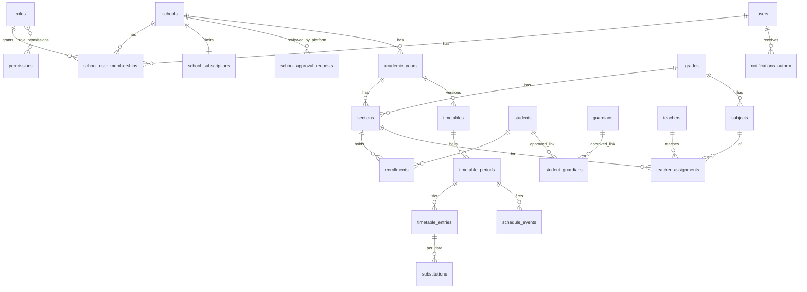

# معماری

## اصول
1. **مدرسه از سرور تعیین می‌شود نه از کلاینت.** `ResolveSchool` عضویت فعال کاربر در مدرسهٔ فعال را بررسی می‌کند؛ سپس `CurrentSchool` (scoped در container) مقدار می‌گیرد. مدل‌های tenant با `BelongsToSchool` یک Global Scope دارند که **بدون tenant هیچ ردیفی برنمی‌گرداند**. Jobها/Commandها با `CurrentSchool::run($school, fn)` وارد زمینهٔ مدرسه می‌شوند.
2. **Idempotency در لایهٔ داده.** رویداد زنگ: `unique(school_id,on_date,period_id,event)`؛ اعلان: `unique(user_id,dedupe_key)`. اجرای دوبارهٔ Job یا هم‌پوشانی Scheduler اثری ندارد. `processed_at` بعد از تحویل ثبت می‌شود (at-least-once + dedupe).
3. **زمان فقط زمان سرور** در منطقهٔ زمانی مدرسه (`schools.timezone`)؛ ذخیرهٔ `fires_at` به UTC. پاسخ‌های همگام‌سازی `server_time` دارند.
4. **سابقه حذف نمی‌شود.** برنامه‌ها بایگانی می‌شوند، دانش‌آموز «بایگانی» می‌شود، سال تحصیلی حذف نمی‌شود، Audit تغییرناپذیر است.

## ماژول‌های Backend (`app/Modules`)
Auth · Tenancy · Schools · Academics · Scheduling · Notifications · Audit — ساخته‌شده.
VirtualClassrooms · Messaging · Assignments · Exams · Grading · ReportCards · AI · Analytics · Support · Administration(گزارش منابع) — مراحل بعد.

## ERD (پیاده‌شده)

جداول فهرست‌شده در سند ولی هنوز بدون Migration: lesson_sessions, session_participants, attendance_records, learning_materials, assignments*, submissions*, exams, questions*, exam_*, grading_rubrics, grades_records, report_cards*, conversations, messages*, announcements, ai_*, support_tickets. هر کدام باید `school_id` + ایندکس `(school_id, …)` داشته باشند و از `BelongsToSchool` استفاده کنند.

## ماتریس مجوز
منبع حقیقت: `backend/config/rbac.php`. نقش‌های `super_admin`/`support` در `users.platform_role` و فقط روی `/platform/*` اعمال می‌شوند؛ **هیچ مجوز پیش‌فرضی برای خواندن داده‌های دانش‌آموزان در سطح platform وجود ندارد.**

| مجوز | مدیر مدرسه | معاون | معلم | دانش‌آموز | والد |
|---|:-:|:-:|:-:|:-:|:-:|
| school.settings / audit.view | ✔ | | | | |
| people.manage | ✔ | ✔ | | | |
| academics.view | ✔ | ✔ | ✔ | | |
| academics.manage | ✔ | ✔ | | | |
| schedule.view / schedule.manage | ✔ | ✔ | | | |
| schedule.own | ✔ | ✔ | ✔ | ✔ | |
| `GET /me/children` (پیوند تأییدشده) | | | | | ✔ |

## قرارداد API
- پیشوند `/api/v1`، JSON، خطا: `{message, errors?, code?}`؛ اعتبارسنجی 422، مجوز 403، یافت‌نشد/خارج‌ازمدرسه 404، محدودیت نرخ 429.
- لیست‌ها صفحه‌بندی سمت سرور (`per_page` ≤ 100/200)، فیلتر `q`, `status`, `grade_id`…
- احراز هویت: `Authorization: Bearer <token>`؛ انتخاب مدرسه: `X-School-Id` (الزامی فقط وقتی کاربر عضو چند مدرسه است).
- مستند OpenAPI: `docs/openapi.yaml`.
